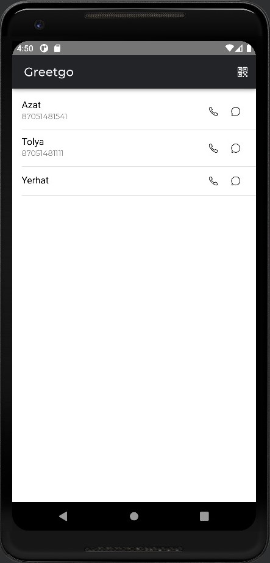
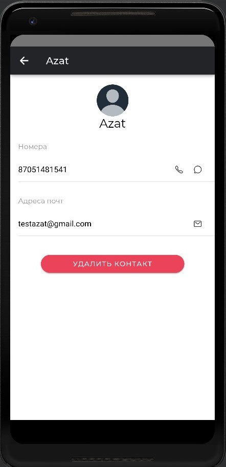

# Тестовое задание выполнил Тазабеков Даулет

## Как установить

1. При переходе на репозиторий нажать на зелёную кнопку Code и в выпавшем окошке Download ZIP
2. Распаковать архив
3. При наличии на компьютере Android Studio открыть приложение, а затем эмулятор
4. Находясь в папке проекта, запустить в терминале следующую команду:
    ionic cap run android -l --external
5. При открытии приложение запросит данные для входа. Логин и пароль — login и password, соответственно

## Приложение

1. 

  

На главном экране присутствует список контаков, полученный из данных телефона. Элементы в списке можно сдвинуть влево, чтобы увидеть кнопку удаления (ПРИМ. функция не работает)
2. В шапке находится иконка, при нажатии на которую запускается сканер QR-кодов (запрашивается допуск к камере телефона). Когда сканер активен, иконка заменяется на крестик, закрывающий сканер
3.

  

Вторая страница, содержащая данные контакта. Выводятся имя, все записанные номера телефонов и все записанные адреса эл. почты. Также внизу присутствует кнопка удаления (ПРИМ. функция не работает)
